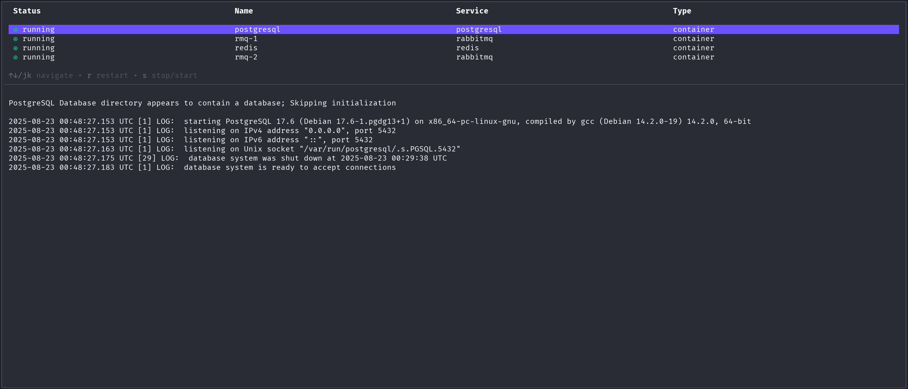

 

    

### Stupidly easy development environment

 

[🚀 Get started](https://dockup.dev/docs) • [📘 Docs](https://dockup.dev/docs) • [📚 Registry](https://dockup.dev/docs) • [🌐 Website](https://dockup.dev)

[Contribute](https://github.com/kerwanp/dockup/CONTRIBUTING.md) • [License](https://github.com/kerwanp/dockup/LICENSE.md)

    

